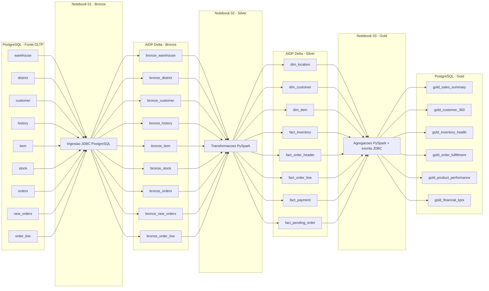

# Fluxo Implementado - Bronze, Silver e Gold

Este documento descreve o fluxo implementado nos notebooks PySpark da pasta `notebooks`.

A arquitetura usa:

- Origem transacional em PostgreSQL.
- Camadas Bronze e Silver como tabelas Delta no Oracle AI Data Platform Workbench.
- Camada Gold publicada em PostgreSQL.
- Notebooks no formato `.ipynb`, com uma celula Markdown explicativa antes de cada celula de codigo.

## Notebooks Implementados

| Ordem | Notebook | Funcao |
|---|---|---|
| 1 | `01_bronze_ingestao_postgresql_delta.ipynb` | Ingerir tabelas PostgreSQL para Bronze Delta. |
| 2 | `02_silver_transformacoes_delta.ipynb` | Transformar Bronze Delta em dimensoes e fatos Silver Delta. |
| 3 | `03_gold_publicacao_postgresql.ipynb` | Agregar Silver e publicar tabelas Gold no PostgreSQL. |

## Visao Geral



## Notebook 01 - Bronze

Arquivo:

- `notebooks/01_bronze_ingestao_postgresql_delta.ipynb`

Objetivo:

- Ler as tabelas transacionais da origem PostgreSQL.
- Preservar a estrutura original dos dados.
- Adicionar metadados tecnicos de ingestao.
- Gravar cada tabela como Delta no catalogo do AIDP.

### Entrada

Origem PostgreSQL:

| Tabela de origem | Tabela Bronze Delta |
|---|---|
| `warehouse` | `bronze_warehouse` |
| `district` | `bronze_district` |
| `customer` | `bronze_customer` |
| `history` | `bronze_history` |
| `item` | `bronze_item` |
| `stock` | `bronze_stock` |
| `orders` | `bronze_orders` |
| `new_orders` | `bronze_new_orders` |
| `order_line` | `bronze_order_line` |

### Saida

Tabelas Delta no namespace:

```text
<AIDP_CATALOG>.<BRONZE_SCHEMA>.<bronze_table>
```

Valores padrao usados pelo notebook:

- `AIDP_CATALOG=main`
- `BRONZE_SCHEMA=bronze`
- `BRONZE_WRITE_MODE=overwrite`

### Metadados Adicionados

Cada tabela Bronze recebe as colunas tecnicas:

- `ingestion_timestamp`
- `source_system`
- `source_table`
- `batch_id`
- `record_hash`

### Conexao PostgreSQL

O notebook usa Spark JDBC nativo com o driver PostgreSQL `42.7.4`.

Variaveis esperadas:

| Variavel | Descricao |
|---|---|
| `PG_HOST` | Host da origem PostgreSQL. |
| `PG_PORT` | Porta PostgreSQL, padrao `5432`. |
| `PG_DB` | Database PostgreSQL. |
| `PG_SCHEMA` | Schema de origem, padrao `public`. |
| `PG_USER` | Usuario PostgreSQL. |
| `PG_PASSWORD` | Senha PostgreSQL. |
| `PG_SSLMODE` | Modo SSL, padrao `require`. |
| `SOURCE_SYSTEM` | Identificacao da origem, padrao `postgresql_tpcc`. |
| `BATCH_ID` | Identificador da carga; se ausente, e gerado automaticamente. |

## Notebook 02 - Silver

Arquivo:

- `notebooks/02_silver_transformacoes_delta.ipynb`

Objetivo:

- Ler tabelas Bronze Delta.
- Padronizar nomes e tipos de colunas.
- Integrar relacionamentos entre entidades.
- Criar dimensoes e fatos Silver em Delta.

### Entrada

Tabelas Delta no namespace:

```text
<AIDP_CATALOG>.<BRONZE_SCHEMA>.<bronze_table>
```

### Saida

Tabelas Delta no namespace:

```text
<AIDP_CATALOG>.<SILVER_SCHEMA>.<silver_table>
```

Valores padrao usados pelo notebook:

- `AIDP_CATALOG=main`
- `BRONZE_SCHEMA=bronze`
- `SILVER_SCHEMA=silver`
- `SILVER_WRITE_MODE=overwrite`

## Tabelas Silver Implementadas

### `dim_location`

Fonte:

- `bronze_warehouse`
- `bronze_district`

Conteudo:

- Armazem, distrito, cidade, estado, CEP, impostos e valores acumulados YTD.

Grao:

- Um registro por `warehouse_id` e `district_id`.

### `dim_customer`

Fonte:

- `bronze_customer`

Conteudo:

- Cadastro do cliente, endereco, telefone, data de cadastro, status de credito, limite, desconto, saldo e contadores historicos.

Grao:

- Um registro por `warehouse_id`, `district_id` e `customer_id`.

### `dim_item`

Fonte:

- `bronze_item`

Conteudo:

- Catalogo de produtos, identificador de imagem, nome, preco e dados adicionais.

Grao:

- Um registro por `item_id`.

### `fact_inventory`

Fonte:

- `bronze_stock`
- `bronze_item`

Conteudo:

- Quantidade em estoque, preco do item, pedidos, pedidos remotos, valor de inventario e dados do estoque.

Grao:

- Um registro por `warehouse_id` e `item_id`.

### `fact_order_header`

Fonte:

- `bronze_orders`
- `bronze_customer`

Conteudo:

- Cabecalho do pedido, cliente, data de entrada, transportadora, quantidade de linhas e flag de pedido local.

Grao:

- Um registro por `warehouse_id`, `district_id` e `order_id`.

### `fact_order_line`

Fonte:

- `bronze_order_line`
- `bronze_orders`
- `bronze_item`

Conteudo:

- Linhas de pedido, item, quantidade, valor, preco unitario calculado, valor bruto, data de entrega e informacao de distribuicao.

Grao:

- Um registro por `warehouse_id`, `district_id`, `order_id` e `order_line_number`.

### `fact_payment`

Fonte:

- `bronze_history`
- `bronze_customer`

Conteudo:

- Pagamentos, cliente, localidade operacional, data, valor e dados descritivos do pagamento.

Grao:

- Um registro por `payment_id`.

### `fact_pending_order`

Fonte:

- `bronze_new_orders`
- `bronze_orders`

Conteudo:

- Pedidos pendentes, cliente, data de entrada, idade do backlog em dias e status `PENDING`.

Grao:

- Um registro por `warehouse_id`, `district_id` e `order_id`.

## Notebook 03 - Gold

Arquivo:

- `notebooks/03_gold_publicacao_postgresql.ipynb`

Objetivo:

- Ler dimensoes e fatos Silver em Delta.
- Criar agregacoes analiticas de negocio.
- Publicar as tabelas Gold no PostgreSQL.

### Entrada

Tabelas Delta no namespace:

```text
<AIDP_CATALOG>.<SILVER_SCHEMA>.<silver_table>
```

### Saida

Tabelas PostgreSQL no schema:

```text
<PG_GOLD_SCHEMA>.<gold_table>
```

Valores padrao usados pelo notebook:

- `AIDP_CATALOG=main`
- `SILVER_SCHEMA=silver`
- `PG_GOLD_SCHEMA=gold`
- `PG_GOLD_PORT=5432`
- `PG_GOLD_SSLMODE=require`
- `GOLD_POSTGRES_WRITE_MODE=overwrite`
- `LOW_STOCK_THRESHOLD=10`

### Conexao PostgreSQL Gold

O notebook publica no PostgreSQL usando Spark JDBC nativo com o driver PostgreSQL `42.7.4`.

Variaveis esperadas:

| Variavel | Descricao |
|---|---|
| `PG_GOLD_HOST` | Host do PostgreSQL Gold. Se ausente, usa `PG_HOST`. |
| `PG_GOLD_PORT` | Porta do PostgreSQL Gold. Se ausente, usa `PG_PORT` ou `5432`. |
| `PG_GOLD_DB` | Database PostgreSQL Gold. Se ausente, usa `PG_DB`. |
| `PG_GOLD_SCHEMA` | Schema de destino, padrao `gold`. |
| `PG_GOLD_USER` | Usuario PostgreSQL Gold. Se ausente, usa `PG_USER`. |
| `PG_GOLD_PASSWORD` | Senha PostgreSQL Gold. Se ausente, usa `PG_PASSWORD`. |
| `PG_GOLD_SSLMODE` | Modo SSL, padrao `require`. |
| `GOLD_POSTGRES_WRITE_MODE` | Modo de escrita JDBC, padrao `overwrite`. |
| `LOW_STOCK_THRESHOLD` | Limite para status `LOW_STOCK`, padrao `10`. |

## Tabelas Gold Implementadas

### `gold_sales_summary`

Fonte:

- `fact_order_line`
- `dim_location`

Indicadores:

- `total_orders`
- `total_quantity`
- `total_revenue`
- `average_ticket`

Grao:

- `sales_date`, `warehouse_id`, `district_id`.

### `gold_customer_360`

Fonte:

- `dim_customer`
- `fact_order_header`
- `fact_order_line`
- `fact_payment`

Indicadores:

- Total de pedidos.
- Valor total comprado.
- Valor total pago.
- Quantidade total de itens comprados.
- Primeira e ultima compra.
- Ultimo pagamento.
- Saldo, limite, desconto e contadores historicos do cliente.

Grao:

- Um registro por `warehouse_id`, `district_id` e `customer_id`.

### `gold_inventory_health`

Fonte:

- `fact_inventory`

Indicadores:

- Quantidade em estoque.
- Valor em inventario.
- Contagem de pedidos.
- Contagem de pedidos remotos.
- Status de estoque: `OUT_OF_STOCK`, `LOW_STOCK` ou `OK`.

Grao:

- Um registro por `warehouse_id` e `item_id`.

### `gold_order_fulfillment`

Fonte:

- `fact_order_header`
- `fact_order_line`
- `fact_pending_order`

Indicadores:

- Total de pedidos.
- Pedidos pendentes.
- Pedidos entregues.
- Pedidos sem transportadora.
- Razao de pedidos locais.
- Prazo medio de entrega em dias.

Grao:

- `order_date`, `warehouse_id`, `district_id`.

### `gold_product_performance`

Fonte:

- `fact_order_line`

Indicadores:

- Receita total.
- Quantidade total vendida.
- Quantidade de pedidos contendo o item.
- Preco medio unitario.
- Ranking por receita.
- Ranking por quantidade.

Grao:

- Um registro por `item_id`.

### `gold_financial_kpis`

Fonte:

- `fact_payment`
- `fact_order_line`
- `dim_location`

Indicadores:

- Total de pedidos.
- Receita estimada.
- Total de pagamentos.
- Valor total de pagamentos.
- YTD de warehouse.
- YTD de district.
- Taxas de warehouse e district.

Grao:

- `metric_date`, `warehouse_id`, `district_id`.

## Ordem de Execucao

Execute os notebooks nesta ordem:

1. `01_bronze_ingestao_postgresql_delta.ipynb`
2. `02_silver_transformacoes_delta.ipynb`
3. `03_gold_publicacao_postgresql.ipynb`

O segundo notebook depende das tabelas Bronze criadas pelo primeiro. O terceiro notebook depende das tabelas Silver criadas pelo segundo.

## Resumo de Persistencia

| Camada | Formato | Destino |
|---|---|---|
| Bronze | Delta | AIDP Master Catalog, schema `BRONZE_SCHEMA` |
| Silver | Delta | AIDP Master Catalog, schema `SILVER_SCHEMA` |
| Gold | PostgreSQL | Database/schema configurado por `PG_GOLD_*` |

## Parametros Principais

| Parametro | Usado em | Padrao |
|---|---|---|
| `AIDP_CATALOG` | Bronze, Silver, Gold | `main` |
| `BRONZE_SCHEMA` | Bronze, Silver | `bronze` |
| `SILVER_SCHEMA` | Silver, Gold | `silver` |
| `BRONZE_WRITE_MODE` | Bronze | `overwrite` |
| `SILVER_WRITE_MODE` | Silver | `overwrite` |
| `GOLD_POSTGRES_WRITE_MODE` | Gold | `overwrite` |
| `PG_SCHEMA` | Bronze | `public` |
| `PG_GOLD_SCHEMA` | Gold | `gold` |
| `PG_SSLMODE` | Bronze | `require` |
| `PG_GOLD_SSLMODE` | Gold | `require` |

## Observacoes Operacionais

- Os notebooks nao possuem credenciais fixas no codigo.
- A conexao PostgreSQL usa variaveis de ambiente.
- O driver JDBC do PostgreSQL e baixado em tempo de execucao se nao existir em `/tmp/postgresql-42.7.4.jar`.
- As tabelas Bronze e Silver sao gravadas com `format('delta').saveAsTable(...)`.
- As tabelas Gold sao gravadas no PostgreSQL com `format('jdbc')`.
- Cada notebook retorna um payload JSON ao final, usando `oidlUtils.notebook.exit(...)` quando disponivel no AIDP.
- Nao ha `spark.stop()` nos notebooks, pois o cluster pode ser compartilhado no Workbench.
